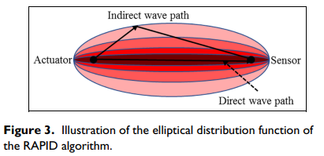
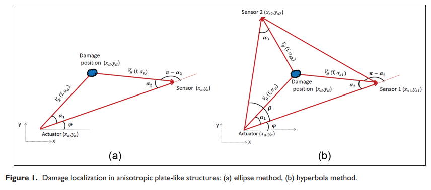
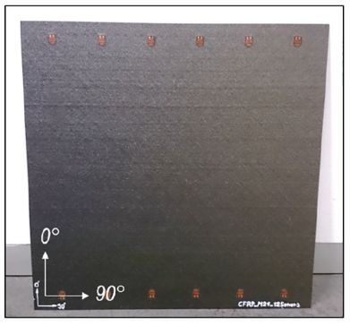
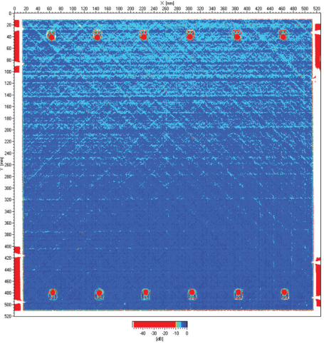
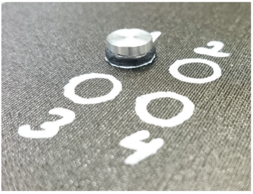

# 基于人工神经网络模型的碳纤维复合板缺陷检测方法

18013107 姚澄宇

[TOC]

## 摘要

本文重点研究一种基于人工神经网络的损伤定位方法。诊断 Lamb 波在损伤前后被压电传感器网络激发和接收，以获得包含损伤特征信息的散射波。在通过连续小波变换（CWT）测量每个执行器-传感器路径中散射波的飞行时间（ToF）之后，使用缺陷概率检测的重构算法（RAPID）获得损伤位置和波速参数的先验概率分布。同时利用马尔可夫链蒙特卡罗（MCMC）方法用于对未知参数的后验分布进行采样。对碳纤维复合板进行了数值研究，并对其进行了实验研究，以验证所提出的贝叶斯损伤定位方法。使用人工神经网络对获得的数据进行训练提高定位精度，减少贝叶斯分析中量化损伤定位中的不确定性。

### 关键词

待补充

## 1. 引言

随着工业的发展，为确保材料的安全性保障，对材料进行损伤表征测量的需求在不断增长。各种形式的裂纹广泛地存在于工程装备构件中，使用过程中交变载荷的作用使构件内裂纹不断扩展。[^01]尽早的对损伤进行检测可以有效的降低设备的维护成本并避免毁灭性事故的发生。无损检测和评估（NDT&E）广泛用于损伤表征，而不会改变所研究材料的性能。然而，尽管在过去的几十年中取得了巨大的进步，但可靠和高效的分层检测仍然是一个具有挑战性的问题。作为重要的超声导波之一，Lamb 波已被证明是导波技术中很有前途的候选者。具有穿透力强、远距离衰减最小的突出优点，可用于检测各种类型的损伤（分层、脱粘、裂纹等）。对于损伤定位，执行器和传感器等压电换能器是通常附着在结构表面形成换能器网络。当执行器激发的兰姆波通过损伤区域时，部分波将在损伤边缘周围散射，并且可以被所有剩余的传感器接收，损伤改变了波的传播并改变了波的特性。根据这些性质的变化，可以推断出损伤状态。

xxx提出xxx，xxx提出xxx，xxx提出xxx。

xxx方法优势与缺点，xxx方法优势与缺点，xxx方法优势与缺点。

现有断层扫描技术（包括椭圆位点法和 RAPID 方法及其变体）的灵敏度和分辨率取决于传感器的密度和排列，有其自身的优点和局限性。因此，非常需要一种可以提高损伤成像的灵敏度和分辨率同时减少上述限制的方法。在这一目标的推动下，本研究的目的是开发一种可靠且稳健的复合损伤定位和成像方法。所提出的方法基于贝叶斯框架中椭圆轨迹和 RAPID 思想的概率整合。本研究的其余部分安排如下：

2. xxx
3. xxx
4. xxx

## 2. 原理与步骤

本文提出的基于人工神经网络的损伤定位方法分为两个部分：建立贝叶斯框架下基于椭圆轨迹法和RAPID方法的损伤识别模型和基于模型检测输入的人工神经网络分析。贝叶斯框架下基于椭圆轨迹法和RAPID方法的损伤识别模型的基本方法是使用RAPID方法获得的初始先验概率与椭圆轨迹方法构建的似然函数联合获得损伤的概率积分。在贝叶斯框架中进行积分获得数据集D的损伤位置参数的后验分布，相较于传统方法具有更高的损伤检测的准确性和有效性。

### 2.1 飞行时间（ToF）的获取

连续小波变换在时频域中均有良好的分辨率，小波通常选用具有有限持续时间或窗口的波形，其平均幅度为零。在测量中，信号$s(t)$的CWT用两个变量定义：
$$
CWT(a,b)=\frac{1}{\sqrt{a}}\int_{-\infty}^{\infty}X(t)\overline{\Psi(\frac{t-a}{b})}dt
$$
其中，$X(t)$表示信号的时间序列，$\Psi(t)$表示分析小波，a>0是CWT的缩放因子，b是时移因子，上划线表示复共轭。在本文中，由于使用复杂Morlet小波以确定所需频率中散射Lamb波的ToF，因此能够有效的分离幅度和相位信息，从而能够测量瞬时频率及其时间演变，提供了一个灵活的窗口，该窗口在高频时变窄，在低频时变宽。

复杂Morlet小波由下式表示：
$$
\psi(t)=\frac{1}{\sqrt{\pi f_b}}exp(\frac{-t^2}{f_b})exp(2\pi f_cjt)
$$
其中 $f_c$ 和 $f_b$ 分别代表中心频率和频率带宽。$f_b$ 控制母小波的形状，对于给定的尺度参数 $a$，它决定了时域和频域的分辨率。

### 2.2 缺陷概率检测的重构算法（RAPID）

缺陷概率检测的重构算法（RAPID）利用激发源和接收器的直线路径上的损伤会产生最显着的变化，并且变化的幅度随着损伤和直接波路径之间距离的增加而减小的原理。损坏位置可以影响其与每个传感器之间的相关性，并且损坏的实际位置可以表示为所有参与的激发源-接收器对的影响的线性总和。因此对于一组激发源-接收器对，其损伤线性递减的椭圆分布如图xxx所示。

每组接收器的相关性系数 $\rho$ 由以下等式给出：
$$
\rho=\frac{\sum_{i=1}^{K}(X_k-\mu_x)(Y_k-\mu_y)}{\sqrt{\sum_{i=1}^{K}(X_k-\mu_x)^2}\cdot\sqrt{\sum_{i=1}^{K}(Y_k-\mu_y)^2}}
$$

其中，$X_k$ 和 $Y_k$ 分别表示基准数据与校验数据。基线数据通常取自空白平板，检测数据取自实际存在损伤的平板，用于损伤检测。$\mu$ 是相应数据的平均值，$K$ 是数据的每个记录点数。 理论上，相关系数值越小，说明目标存在损伤的可能性越高。 如果两个信号定义相同，则相关系数将接近于 1。

对给定的激发源-接收器对，损伤的空间分布的权重函数呈现线性递减的椭圆状图案，其焦点位于两个传感器处。将板状结构华为均匀分布的网格，并估计每个网格存在损伤的概率。以 $N_p$ 表示参与的传感器路径的数量，在位置$(x,y)$ 处存在损伤的概率 $Pr$ 可以表示为：
$$
Pr(x,y)=\frac{1}{N_p}Pr_i(x,y)=\frac{1}{N_p}\sum_{i=1}^{N_p}(1-\rho_i)\frac{\beta-R_i(x,y)}{\beta-1}
$$
其中，$Pr_i(x,y),i=1,2,...,N_p$ 是第 i 个传感器对的损坏概率分布，$\rho_i$ 是根据公式（3）给出的相关系数。公式（4）最右端的 $\frac{\beta-R_i(x,y)}{\beta-1}$ 是第 i 条路径的空间分布函数，其轮廓为椭圆形。$\beta$ 是控制 RAPID 分布区域大小的缩放参数。$R_i(x,y)$ 是由下式得出：
$$
R_i(x,y)=
\begin{cases} 
RD_i(x,y), &RD_i(x,y)<\beta \\
\beta, &RD_i(x,y)\geqslant\beta
\end{cases}
$$
式中 $RD_i(x,y)$ 为：
$$
RD_i(x,y)=\frac{\sqrt{(x-x_a)^2+(y-y_a)^2}+\sqrt{(x-x_b)^2+(y-y_b)^2}}{\sqrt{(x_b-x_a)^2+(y_b-y_a)^2}}
$$
其中，$(x_a,y_a)$ 和 $(x_b,y_b)$ 分别是激发源与接收器在第 i 条路径上的坐标。参数 $\beta$ 是根据具体情况根据经验确定的。先前的研究表明，一个小的比例参数会减少由换能器对识别的受影响区域，使成像结果变得清晰。 相反，较大的缩放参数会扩大受影响的区域，使成像结果变得模糊。在相似的实验中 $\beta$ 通常设置在 1.05 左右，这里同样取1.05。

### 2.3 椭圆轨迹法

$N$ 个压电元件耦合在试件上组成的传感器网络中，每个换能器都可以作为激发源与接收器。Lamb 波在第 i 组激发源-接收器对路径中因损伤而散射的 ToF 定义为 Lamb 波从致动器传递到传感器的总时间。一组激发源-接收器对，可以使用ToF模型来定位损伤在板状结构上的几何位置。每组激发源-接收器对可以绘制一个椭圆表示损伤位置，多组激发源-接收器对损伤椭圆叠加交点处位板状结构上点状损伤的几何位置，其效果如图xxx所示。

在前文中使用CWT获取ToF时间后，对于一组激发源-接收器对可以简单的使用下式获得损伤的位置：
$$
T_{ToF}=\frac{\sqrt{(x_d-x_a)^2+(y_d-y_a)^2}}{V_g(f)}+\frac{\sqrt{(x_d-x_b)^2+(y_d-y_b)^2}}{V_g(f)}
$$
其中，$(x_d,y_d)$，$(x_a,y_a)$，$(x_b,y_b)$ 分别表示损伤位置、激发源、接收器在板状结构中的位置关系，$V_g(f)$ 表示特定激发频率 $f$ 下散射Lamb波的波速。式中激发源、接收器和板状结构的大小可能会影响理论波速值的准确性。

### 2.4 贝叶斯框架

本研究所采用贝叶斯系统识别是基于散射Lamb波的 ToF 来定位损伤的概率分布。 贝叶斯方法不是使用确定性方法来精确定位单个解决方案，而是可以提供未知参数的概率密度函数（PDF），同时给出目标点和区间估计。 贝叶斯系统识别的基本思想是将参数（通常用向量 $\theta$ 表示）视为具有联合分布 $p(\theta)$ 的随机变量。 它旨在计算给定一组测量数据的不确定参数的后验（更新）分布。 最终的参数估计可以取为后验的平均值或使后验分布最大化的值。使用使用 RAPID 作为先验分布的损坏位置的估计分布，在给定测量数据的情况下，利用椭圆轨迹法可以使用贝叶斯规则获得不确定参数的后验分布。使用变量 $\varepsilon$ 描述损伤位置的理论预测与测量位置之间误差。第 i 个激发源-接收器对的路径 Ti 的 ToF 的概率描述可以表示为
$$
T_i=T_i^{TH}(x_d,y_d)+\varepsilon
$$
其中，$T_i^{TH}(x_d,y_d)$ 是基于损伤位置参数理论与等式（7）得到的损伤确定位置。将式中的不确定参数用 $\theta=(x_d,y_d,\sigma)$ 表示。在通常情况下，$\varepsilon$ 是标准差为 $\sigma$ 的正态分布。测量数据的似然函数可以写为
$$
p(D|\theta)=\sum_{i=1}^{N_p} \frac{1}{\sqrt{2\pi}\sigma}\cdot\left\{ -\frac{\sum_{i=1}^{N_p}[T_i-T_i^{TH}(x_d,y_d)]^2}{2\sigma^2} \right\}
$$
使用贝叶斯原理，参数向量的后验概率密度函数（PDF）可以表示为
$$
p(\theta|D)\propto p(D|\theta)\cdot p(\theta)
$$
其中 $p(\theta)$ 参数的联合先验 PDF，该 PDF 由RAPID方法中等式（4）与 $\varepsilon$ 的正态分布函数联合取得，可以写为
$$
p(\theta)=\frac{1}{\sigma^{N_P}}\sum_{i=1}^{N_p}(1-\rho_i)\frac{\beta-R_i(x_d,y_d)}{\beta-1}
$$
等式（11）结合前文的等式（8）（9）可以得到 $\theta$  的后验分布，进而得到损伤位置 $(x_d,y_d)$ 的概率分布函数。

### 2.5 马尔可夫链蒙特卡罗方法（MCMC）？？？

基于RAPID方法得到 $(x_d,y_d)$ 的先验分布已经可以大概估计损伤的位置，为了估计 u 的后验分布，使用马尔可夫链蒙特卡罗 (MCMC) 方法从等式 (11) 中抽取样本。由于马尔科夫链的性质，所获得的平稳分布等于所需要的概率密度函数。这里所使用的Metropolis-Hastings采样是一种常用的MCMC方法，用于从难以直接采样的概率分布中获取随机样本序列。该方法的伪代码描述在下面作为算法 1 提供：

xxx

### 2.6 神经网络架构和训练算法

## 3. 实验结果与验证

### 3.1 实验数据的选用

随着超声波导波的重要性迅速增长，几乎定期出现新的信号评估技术。不幸的是，经常缺乏真实的数据测试或至少是可理解的数据采集。为了能够在相互的基础上比较评估方法，Ultrasonic Guided Waves提供了一个透明的真实大范围测量数据集。为了能够使用有效且真实的数据，本次实验的数据将基于此导波数据集。

此实验使用碳纤维复合板作为基板，其尺寸为 $500mm\cdot500mm$，厚度为 $2mm$。在板上配备了12个压电换能器，用于在一发一收配置的测试中采集导波数据。其分布如图x。这些换能器由嵌入在聚合物中的锆钛酸铅 (PZT) 圆盘以及所需的电极、电触点和绝缘体组成。压电片圆盘的厚度为 $0.2mm$，直径为 $5mm$。压电换能器的嵌入提供了电绝缘和机械预压缩，使压电陶瓷能够抵抗变形。

> 图xxx, （a）“SHM 板”配备 12 个传感器。 一排六个等距换能器布置在板的顶部和一排在板的底部。 在两个板中，水平方向表示90°的纤维取向，垂直方向表示0°的纤维取向。（b）带有 12 个共键压电换能器的“SHM 板”的超声 NDT 的背壁回波。

使用超声波测试进行基线状态表征，所有试样均经过超声波无损探伤检查，以验证未损坏状态。板状结构的损伤采用可逆缺陷模型，铝盘通过粘性胶带安装在 CFRP 板的表面上实现。（如图xxx）尽管这种参考损伤相对于实际分层的几何形状进行了简化，但它与导波的相互作用在特定特征方面表现相似，例如飞行时间的变化或幅度的降低等。

> 直径为 10 毫米的铝盘形式的可逆损伤模型的照片，通过粘性胶带与结构耦合。 白色圆圈表示四个紧密间隔的损坏位置。

以碳纤维聚合物版的左下角作为原点建立直角坐标系，每个压电换能器与损伤的位置在下方表格中给出：

表格：压电换能器和损伤的坐标

### 3.2 信号处理和特征提取

#### 3.2.1 ToF的获取

图xxx显示传感器1，12在未损坏状态下的激励信号和感应信号。使用复数 Morlet 小波的 CWT 用于分析波信号，以获得从执行器到传感器 1，12 的 Lamb 波的 ToF。

### 3.3 模型的判断与结果对比

### 3.4 训练数据

## 4. 结论

## 引用

[^0x]: Moll J, Kathol J, Fritzen C P, et al. Open guided waves: online platform for ultrasonic guided wave measurements[J]. Structural Health Monitoring, 2019, 18(5-6): 1903-1914.
[^01]:邵鹏飞. 机械裂纹无损检测方法综述[J]. 建筑工程技术与设计,2018(18):1178.
[^03]:
